## Kodiアドオン：フォトビューア

macOSの写真アプリケーションで管理されている写真をTV画面で閲覧するためのKodiアドオンです。
写真アプリケーションのデータベースを参照し、撮影日、撮影場所、顔画像認識による人物等にしたがって写真やビデオをブラウズできます。

macOS Sequoia（バージョン15.3.2）の写真アプリケーション（バージョン10.0 (741.0.130)）にて動作を確認しています。
Raspberry Pi OSにおいても、macOSの _写真ライブラリ.photoslibrary_ をあらかじめコピーしておき、このコピー先を写真ライブラリのパスとして設定することで動作することを確認しています。

はじめに[アドオン設定画面](#アドオン設定画面)で写真ライブラリへのパスを設定してください。

 

## メイン画面

アドオン起動直後にメイン画面が表示されます。

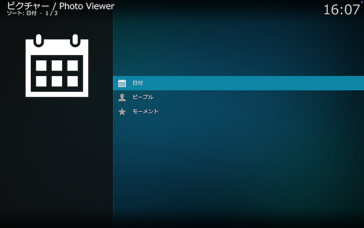

 

## 日付

写真の撮影日の年、月、日で絞り込みます。

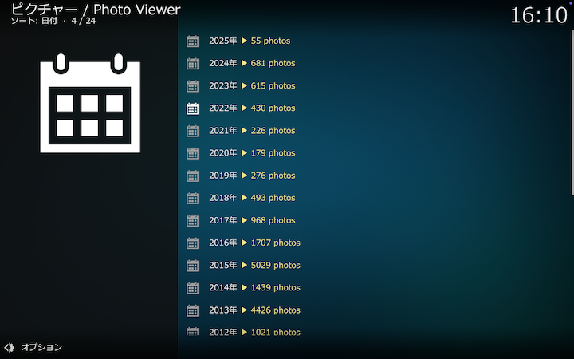

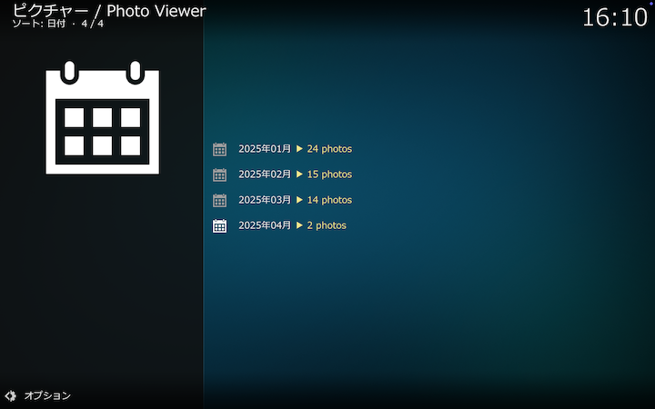

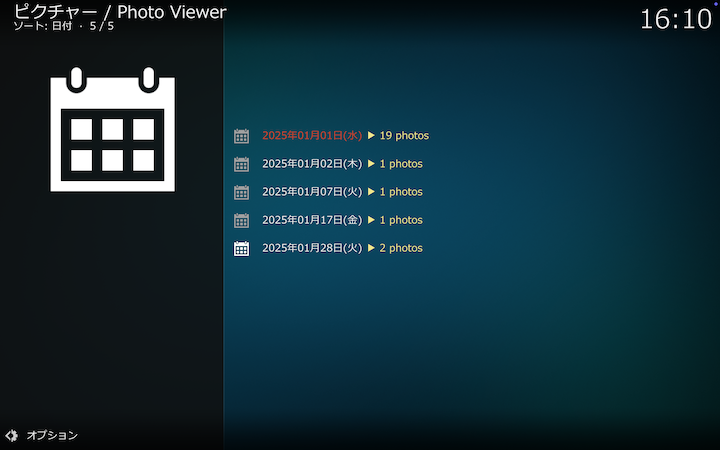

### 日付のコンテクストメニュー

撮影日の絞り込み時に、年または月単位にまとめて絞り込みます。

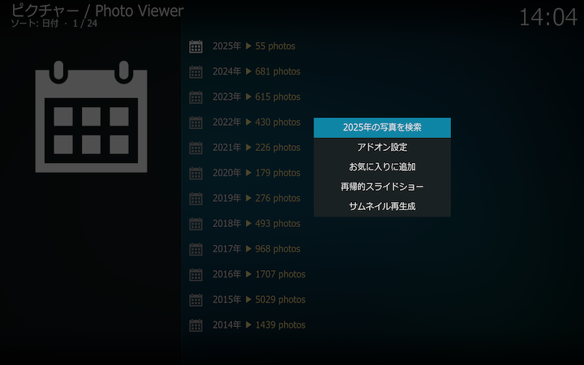

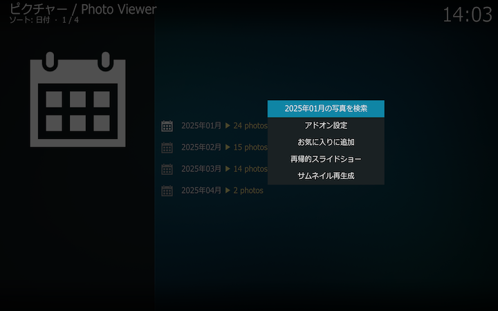

 

## ピープル

写真アプリが判定した顔画像にしたがって人物で絞り込みます。

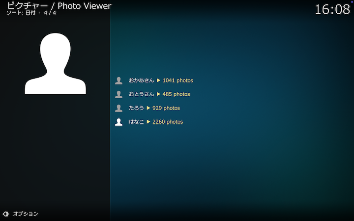

 

## モーメント

写真アプリが判定したモーメントにしたがって絞り込みます。
各モーメントのおおよその位置から、緯度の高い順に（北から順に）表示します。

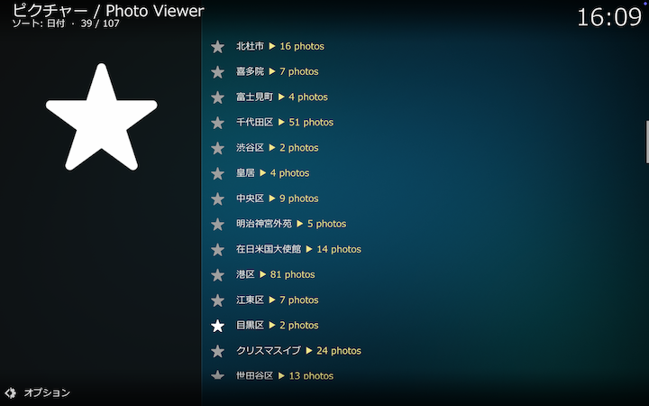

 

## 写真一覧

日付、ピープル、モーメントで絞り込んだ結果が写真一覧として表示されます。
写真にGPS情報がある場合は _[GPS]_、ビデオの場合は _[VIDEO]_ が末尾に付記されます。
クリックすると選択した写真が拡大表示されます。

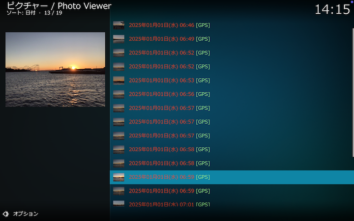

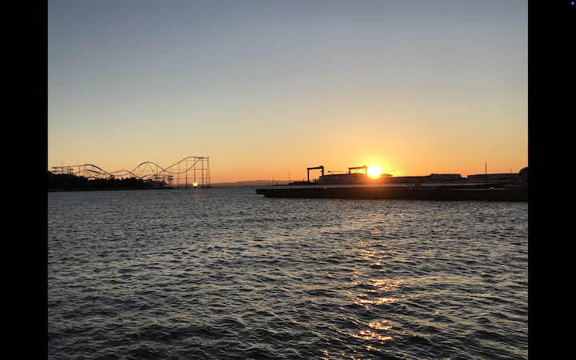

### 写真一覧のコンテクストメニュー

GPS情報がある写真（末尾に _[GPS]_ が付記された写真）については、コンテクスメニューから選択して撮影地周辺の地図や撮影地周辺で撮影された写真を表示できます。

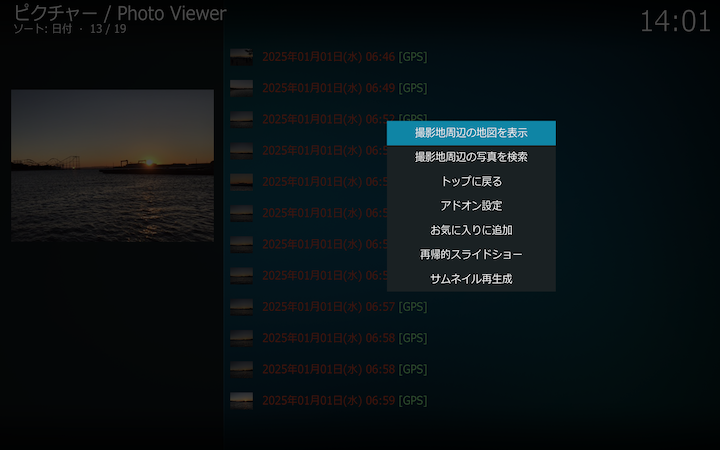

### 撮影地周辺の地図を表示

撮影地周辺の地図を表示します。
まずズーム選択で表示する地図の範囲を18段階で指定します。

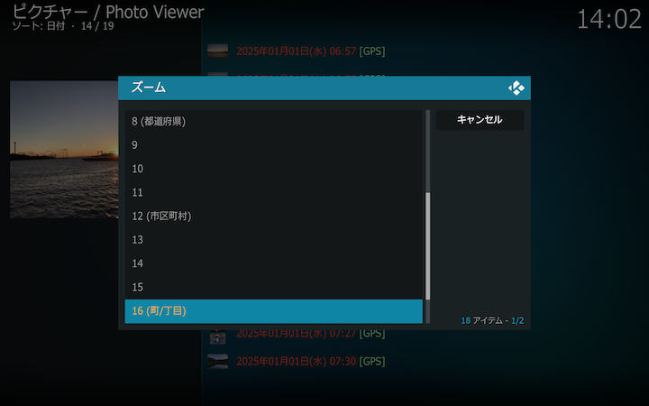

選択した範囲の地図が表示されます。中心の赤丸が選択した写真の撮影地の位置です。
地図の描画には[staticmap](https://github.com/komoot/staticmap)を用いています。

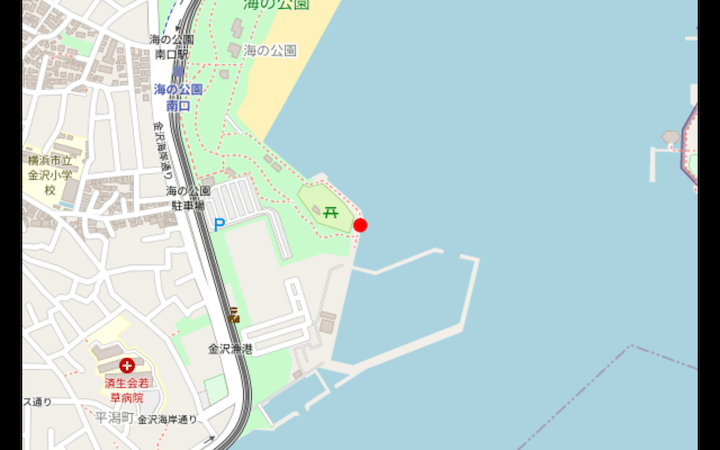

### 撮影地周辺の写真を検索

GPS情報があるすべての写真から、撮影地が[周辺撮影地検索範囲](#周辺撮影地検索範囲)内にある写真を検索して、[周辺撮影地検索上限](#周辺撮影地検索上限)まで近い順に表示します。

 

## アドオン設定画面

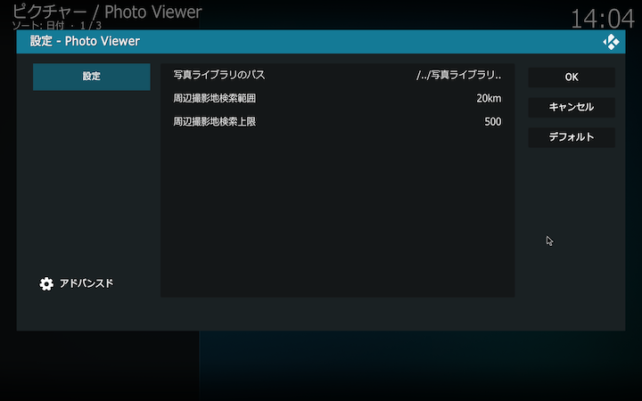

### 写真ライブラリへのパス

写真ライブラリへのパスを設定してください。
macOSのデフォルトでは _/Users/(username)/Pictures/写真ライブラリ.photoslibrary_ になります。

macOSでは _写真ライブラリ.photoslibrary_ のDBに直接アクセスするため、システム設定→プライバシーとセキュリティ→フルディスクアクセスで、Kodiにフルディスクアクセスを許可するよう事前に設定してください。
この許可が設定されていない場合、アドオン設定で _写真ライブラリ.photoslibrary_ が選択できません。

Raspberry Pi OSにおいても、macOSの _写真ライブラリ.photoslibrary_ をあらかじめコピーしておき、このコピー先を写真ライブラリのパスとして設定することで動作することを確認しています。

### 周辺撮影地検索範囲

[撮影地周辺の写真を検索](#撮影地周辺の写真を検索)する際の、検索範囲を指定します。

### 周辺撮影地検索上限

[撮影地周辺の写真を検索](#撮影地周辺の写真を検索)する際の、表示する検索結果の数の上限を指定します。

